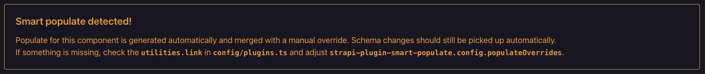
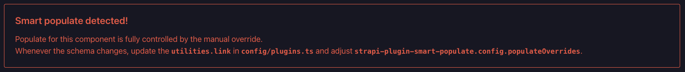

<div align="center">
  <picture>
    
  </picture>
  <h1  style="margin-top:20px;">Smart Populate Plugin for Strapi V5</h1>
  <p>by<br />
  <a href="https://notum.tech/?utm_source=strapi-plugin&utm_medium=github&utm_campaign=smart-populate-readme">
    
  </a>
  </p>

  <p>
    Keep large Strapi projects fast by replacing huge dynamic-zone populate objects <br />
    with a small <code>"smart"</code> populate token.
  </p>

  <!-- Badges -->
  <p>
    <a
      href="https://github.com/notum-cz/strapi-plugin-smart-populate/graphs/contributors"
    >
      
    </a>
    <a href="https://github.com/notum-cz/strapi-plugin-smart-populate/commits">
      
    </a>
    <a href="https://github.com/notum-cz/strapi-plugin-smart-populate/issues/">
      
    </a>
    <a
      href="https://github.com/notum-cz/strapi-plugin-smart-populate/blob/main/LICENSE"
    >
      
    </a>
    <a
      href="https://github.com/notum-cz/strapi-plugin-smart-populate/stargazers"
    >
      
    </a>
  </p>

  <h4>
    <a href="https://github.com/notum-cz/strapi-plugin-smart-populate/issues/"
      >Report Bug or Request Feature</a
    >
  </h4>
</div>

<br />

<!-- Table of Contents -->

# Table of Contents

- [Table of Contents](#table-of-contents)
  - [About the Project](#about-the-project)
    - [Why this plugin exists](#why-this-plugin-exists)
    - [How it works](#how-it-works)
    - [Features](#features)
    - [Supported Versions](#supported-versions)
  - [Getting Started](#getting-started)
    - [Installation](#installation)
    - [Enable the plugin](#enable-the-plugin)
    - [Add the REST middleware](#add-the-rest-middleware)
  - [Usage](#usage)
    - [Documents API](#documents-api)
    - [REST API](#rest-api)
    - [Components and nested components](#components-and-nested-components)
  - [Populate Overrides](#populate-overrides)
    - [Typed overrides](#typed-overrides)
    - [Merging behavior](#merging-behavior)
  - [TypeScript](#typescript)
    - [Minimal wrapper](#minimal-wrapper)
    - [Project type export example (Experimental)](#project-type-export-example-experimental)
  - [Admin Banner](#admin-banner)
  - [🤝 Community](#-community)
    - [Maintained by Notum Technologies](#maintained-by-notum-technologies)
      - [Current maintainer](#current-maintainer)
      - [Contributors](#contributors)
    - [Contributing](#contributing)

## About the Project

### Why this plugin exists

Large Strapi projects often contain many reusable components inside dynamic
zones. As the content model grows, the populate object needed to fetch those
components can become very large. Sending that object from the frontend on every
request means Strapi has to parse, validate, and process a heavy populate query
again and again.

That can make Strapi slower, especially for pages with many dynamic zones and
nested components. In more demanding projects, the API can become unstable or
start failing under load.

`strapi-plugin-smart-populate` moves that responsibility into Strapi. Instead of sending
a large populate object from the frontend, callers can use `"smart"` where they
want Strapi to resolve the correct component populate shape.

### How it works

When Strapi starts, the plugin reads the available component schemas and builds
a smart populate map for components, nested components, media fields, and
relations. When a REST query or a Documents API call contains `"smart"` inside
`populate`, the plugin replaces it with the generated populate object that
matches the current content type, component, or dynamic zone.

Relations that need a more specific shape can be configured with
`populateOverrides`. See [Populate Overrides](#populate-overrides) for details.

### Features

- Uses `"smart"` as a compact populate token for dynamic zones and components.
- Generates populate configuration from Strapi component schemas at bootstrap.
- Supports multiple dynamic zones in the same request.
- Supports components, and nested component paths.
- Supports media and relation attributes inside generated component populate.
- Supports manual `populateOverrides` for project-specific relation shapes.
- Provides TypeScript helpers for smart populate params, editor autocomplete,
  and typed overrides.
- Includes a Content-Type Builder admin banner for components with overrides.

### Supported Versions

This plugin is compatible with Strapi `v5.x.x` and has been tested on Strapi
`v5.48.0`. We expect it should also work on older versions of Strapi V5.

| Plugin version | Strapi Version | Full Support |
| -------------- | -------------- | ------------ |
| `0.x`          | `^5.48.0`      | ✅           |

## Getting Started

### Installation

Install the plugin via npm or yarn:

```bash
# NPM
npm install strapi-plugin-smart-populate

# Yarn
yarn add strapi-plugin-smart-populate
```

If you install directly from GitHub:

```bash
yarn add github:notum-cz/strapi-plugin-smart-populate
```

### Enable the plugin

Create or update `config/plugins.ts` in your Strapi app:

```ts
export default () => ({
  'strapi-plugin-smart-populate': {
    enabled: true,
  },
});
```

Rebuild Strapi and start the app:

```bash
yarn build
yarn develop
```

### Add the REST middleware

To use `"smart"` in REST API queries, add the plugin middleware to
`config/middlewares.ts`.

Place it after `strapi::query` and before `strapi::body`. At that point Strapi
has already parsed the query, but has not yet validated the populate value.

```diff
export default [
  'strapi::errors',
  'strapi::security',
  'strapi::cors',
  'strapi::poweredBy',
  'strapi::logger',
  'strapi::query',
  // Position is important, place after `strapi::query` and before `strapi::body`.
+ 'plugin::strapi-plugin-smart-populate.sanitize-smart-populate',
  'strapi::body',
  'strapi::session',
  'strapi::favicon',
  'strapi::public',
];
```

The Documents API middleware is registered automatically during the plugin
bootstrap lifecycle.

## Usage

Use `"smart"` where you would normally provide a large populate object for a
component or dynamic zone.

You can use it for one or many dynamic zones in the same query. The plugin
collects all `"smart"` paths and resolves each of them independently.

### Documents API

```ts
await strapi.documents('api::page.page').findMany({
  populate: {
    content: 'smart',
    footerBlocks: 'smart',
  },
});
```

### REST API

```ts
const query = qs.stringify({
  populate: {
    content: 'smart',
  },
});
```

### Components and nested components

The token also works for component attributes:

```ts
await strapi.documents('api::page.page').findOne({
  documentId,
  populate: {
    seo: 'smart',
  },
});
```

And it can be used deeper inside an existing populate object:

```ts
await strapi.documents('api::page.page').findMany({
  populate: {
    sections: {
      populate: {
        items: 'smart',
      },
    },
  },
});
```

The plugin collects all `"smart"` paths, replaces them with a native Strapi-safe
populate value before request validation, and then injects the generated populate
object before the final Documents API query runs.

## Populate Overrides

The generated populate object is based on Strapi schemas. That is a good default
for most components, nested components, media fields, and relations.

Relations are intentionally populated only at the first level by default.
Relations can become very large, so it is usually better to control them
manually instead of letting an automatic populate generator expand them too far.

You may want to limit it to a small set of fields, or explicitly expand it when
the project needs a deeper relation shape. For example, a link component may only need the `fullPath` field from a related page. Use `populateOverrides` for those cases.

### Typed overrides

If you want TypeScript to validate the override shape, create a component
populate map in the host Strapi project and pass it to
`PopulateOverrideEntries`.

The plugin cannot create this map internally because it does not have access to
your generated Strapi component UIDs and schemas. Those types only exist inside
the consuming Strapi project.

```ts
import type { Modules, UID } from '@strapi/strapi';
import type { PopulateOverrideEntries } from 'strapi-plugin-smart-populate/types';

type ComponentPopulateMap = {
  [TComponentUID in UID.Component]: Required<
    Modules.Documents.Params.Pick<TComponentUID, 'populate:object'>
  >['populate'];
};

const populateOverrides = [
  {
    componentUid: 'utilities.link',
    mergeWithGeneratedPopulate: true,
    overridePopulate: {
      page: {
        fields: ['fullPath'],
      },
    },
  },
] satisfies PopulateOverrideEntries<ComponentPopulateMap>;

export default () => ({
  'strapi-plugin-smart-populate': {
    enabled: true,
    config: {
      populateOverrides,
    },
  },
});
```

You can also write `populateOverrides` manually without `satisfies`. The helper
type only exists to make the config easier to validate and maintain.

### Merging behavior

When `mergeWithGeneratedPopulate` is `true`, the override is merged with the
schema-generated populate object for that component.

When `mergeWithGeneratedPopulate` is omitted or `false`, `overridePopulate`
becomes the full populate object for that component.

## TypeScript

The plugin exports generic wrapper types from `strapi-plugin-smart-populate/types`.

These helpers intentionally do not import generated Strapi schemas. A plugin
package does not know the generated types of the project that consumes it. The
intended pattern is to export your own project types from the Strapi app and
wrap the relevant Strapi params with the helpers from this plugin.

When those wrapped params are used in your project, TypeScript keeps the native
Strapi populate shape and adds `"smart"` as an available value in populate
positions. That means your editor can autocomplete the smart token where it is
valid instead of forcing every caller to remember or manually type the string.

### Minimal wrapper

```ts
import type { Modules, UID } from '@strapi/strapi';
import type { WithSmartPopulate } from 'strapi-plugin-smart-populate/types';

export type FindMany<TContentTypeUID extends UID.ContentType> = WithSmartPopulate<
  Modules.Documents.ServiceParams<TContentTypeUID>['findMany']
>;
```

### Project type export example (Experimental)

This is the pattern we as Notum commonly use in project-level Strapi type exports:

```ts
import type { Modules, UID } from '@strapi/strapi';
import type {
  WithSmartPopulate,
  WithSmartPopulateResultParams,
} from 'strapi-plugin-smart-populate/types';

// Re-export document engine service function types
export type FindMany<TContentTypeUID extends UID.ContentType> = WithSmartPopulate<
  Modules.Documents.ServiceParams<TContentTypeUID>['findMany']
>;

export type FindFirst<TContentTypeUID extends UID.ContentType> = WithSmartPopulate<
  Modules.Documents.ServiceParams<TContentTypeUID>['findFirst']
>;

export type FindOne<TContentTypeUID extends UID.ContentType> = WithSmartPopulate<
  Modules.Documents.ServiceParams<TContentTypeUID>['findOne']
>;

// Re-export original Result type
export type Result<
  TSchemaUID extends UID.Schema,
  TParams extends { populate?: unknown } = never,
> = Modules.Documents.Result<
  TSchemaUID,
  WithSmartPopulateResultParams<
    TParams,
    Modules.Documents.Params.Pick<TSchemaUID, 'fields' | 'populate'>
  >
>;
```

If you want to support also fetchAll functions. You can add more robust type configuration for Result export.

```ts
export type Result<
  TUID extends UID.ContentType,
  TParams extends { populate?: unknown } = never,
> = WithSmartPopulateResult<
  Modules.Documents.Result<
    TUID,
    WithSmartPopulateResultParams<
      TParams,
      Modules.Documents.Params.Pick<TUID, 'fields' | 'populate'>
    >
  >,
  TParams,
  {
    contentType: Data.ContentType<TUID>;
    populatableKeys: Extract<Schema.PopulatableAttributeNames<TUID>, keyof Data.ContentType<TUID>>;
  }
>;
```

Frontend apps and shared packages can then import from your project-owned Strapi
type export:

```ts
import type { FindMany, Result } from '@repo/strapi/types';

type PageFindManyParams = FindMany<'api::page.page'>;
type PageResult<TParams extends { populate?: unknown } = never> = Result<'api::page.page', TParams>;
```

You can also see this pattern used in the latest version of our
[Strapi + Next.js monorepo starter](https://github.com/notum-cz/strapi-next-monorepo-starter).

## Admin Banner

The plugin adds a small Content-Type Builder integration. When you open a
component that has a matching `populateOverrides` entry, the admin displays a
banner on that component screen.

The banner color depends on how the override is configured:

**Merged override warning:**
If `mergeWithGeneratedPopulate` is `true`, the banner is displayed as a
warning. The component still uses the generated populate config, but the
manual override is merged into it.


**Manual override alert:**
If `mergeWithGeneratedPopulate` is omitted or `false`, the banner is displayed
as a red alert. In this mode the manual override fully replaces the generated
populate config for that component.


This makes schema maintenance safer. When someone changes a component schema in
the Content-Type Builder, the banner makes it visible that the smart populate
behavior is partially or fully controlled by a manual override and should be
reviewed.

## 🤝 Community

### Maintained by [Notum Technologies](https://notum.tech/?utm_source=strapi-plugin&utm_medium=github&utm_campaign=smart-populate-readme)

Built and maintained by [Notum Technologies](https://notum.tech/?utm_source=strapi-plugin&utm_medium=github&utm_campaign=smart-populate-readme), a Czech-based Strapi Enterprise Partner with a passion for open-source tooling.

#### Current maintainer

[Libor Říha](https://github.com/liborriha)

#### Contributors

<a href="https://github.com/notum-cz/strapi-plugin-smart-populate/graphs/contributors">
  
</a>

### Contributing

Contributions of all kinds are welcome: code, documentation, bug reports, and feature ideas.
<br> <br> Browse the [open issues](https://github.com/notum-cz/strapi-plugin-smart-populate/issues) to find something to work on, or open a new one to start a discussion. Pull requests are always appreciated!

If you'd like to directly contribute, check our [Contributions document](https://github.com/notum-cz/strapi-plugin-smart-populate?tab=contributing-ov-file).
